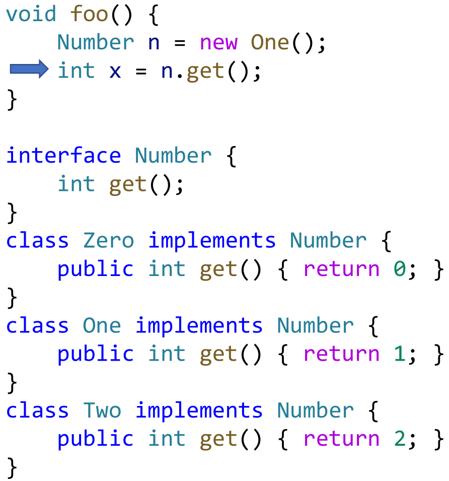
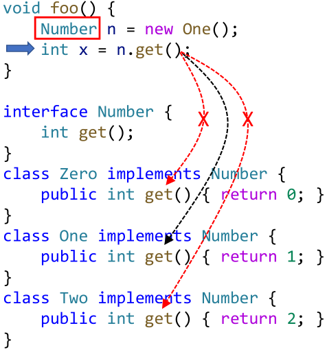
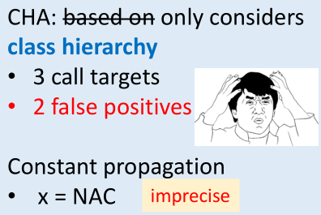
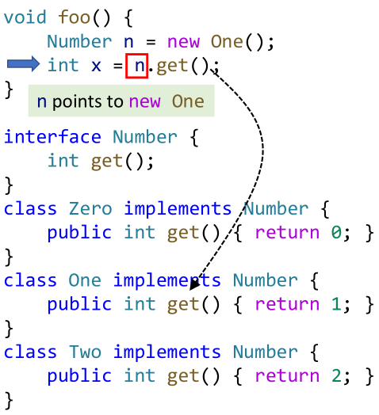
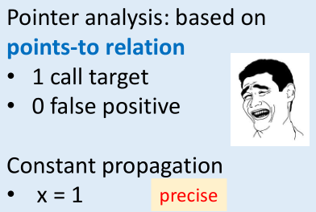
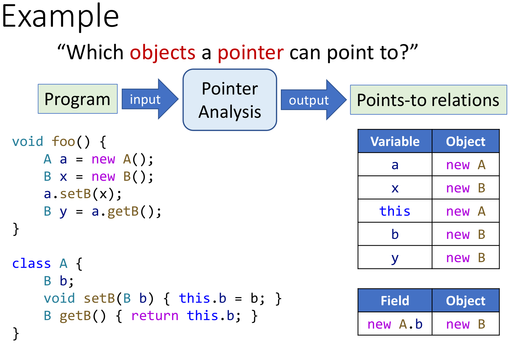
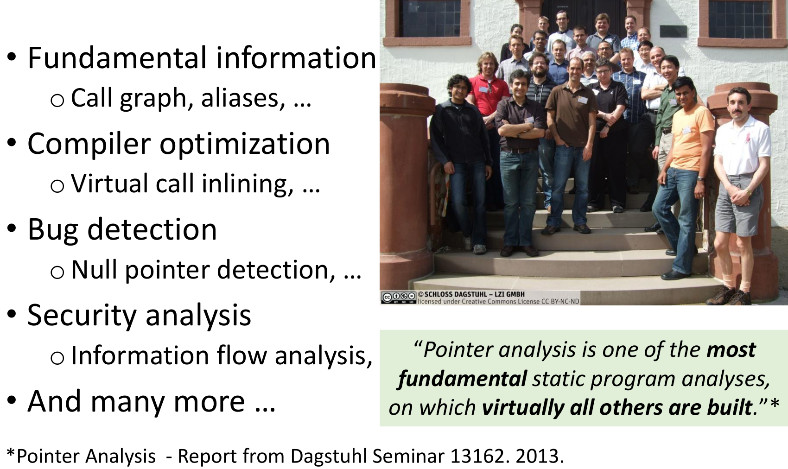
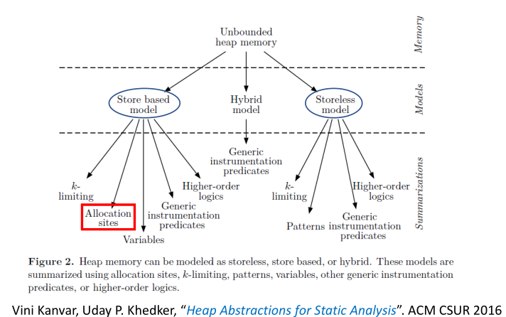
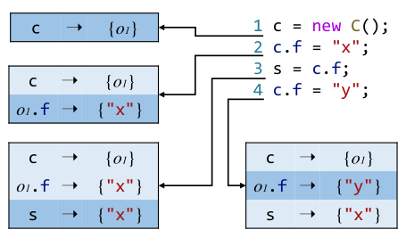
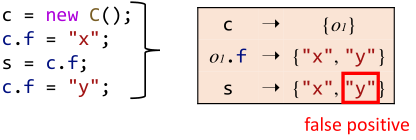

# 指针分析简介

## 指针分析简介

**指针分析这一部分相对较难，将会有五节课讲授相关内容。**

**本课主要内容如下：**

1. Motivation
2. Introduction to Pointer Analysis
3. Key Factors of Pointer Analysis
4. Concerned Statements

## Motivation

接下来我们对比基于CHA的分析方法和指针分析的分析方法。首先，回想一下CHA的构造过程。在这个程序中对`get（）`的调用，在CHA分析下，应该调用哪几个方法？



### 使用CHA分析



可以看出，由于只关心类的层次结构，分析结果的三个箭头中有两个是false positive。也因此导致了分析结果的不精确。



### 使用指针分析

利用指针分析，我们能知道n指向的对象就是new One\(\)语句所新建出来的对象。所以能精确地知道x一定会取1。





**比较两种分析，可以看出CHA速度快而精度低，接下来我们学习高精度的指针分析。**

## Introduction to Pointer Analysis

程序中保存一个地址的东西都可以视为指针（Pointer/Reference）。

* Regarded as a may-analysis
  * Computes an over-approximation of the set of objects that a pointer can point to, i.e., we ask “a pointer may point to which objects?”

什么是指针分析呢？举个例子（省略中间过程）：



### 区分指针分析与别名分析

Pointer Analysis and Alias Analysis are 2 closely related but different concepts.

* Pointer analysis: **which** objects a pointer can point to?
* Alias analysis: **can** two pointers point to the same object?

Example-If two pointers, say p and q, refer to the same object, then p and q are aliases.

```cpp
// p and q are aliases
p = new C();
q = p;

// x and y are not aliases
x = new X();
y = new Y();
```

**Alias information can be derived from points-to relations.**

### 指针分析有多重要？

> 业界大佬们说它很重要。



## Key Factors of Pointer Analysis

此处有战术喝水。（现场梗）

* Pointer analysis is a complex system
* Multiple factors affect the precision and efficiency of the system


### Heap Abstraction

在动态执行中，由于循环和递归的结构，堆上的对象数量可以是无限的。如果不做抽象，面对无限的对象，分析算法可能根本停不下来。

```cpp
for (…) {
    A a = new A();
}
```

解决方法也很简单，学校里同学太多了就分成班级来管理，我们也可以对堆上的对象进行抽象：


相关的技术有很多，这里只讲一个最常用的分支Allocation-Site Abstraction。而Storeless的方法本课程不涉及。



#### Allocation-Site Abstraction

虽然动态时对象的个数可能是无限的，但是new语句的个数一定是有限的。我们可以按照new语句来进行抽象。


### Context Sensitivity

首先我们需要了解什么是（被调用方法的）**调用上下文（calling contexts）**。调用上下文记录的是函数调用前后相关变量的值。例如，参数和返回值是上下文的一部分。

如果将上下文做区分（进行额外的标记，如记录下图中p指向的目标），对参数不同时的调用做不同的分析，则称为**上下文敏感分析**。


反之，如果不区分上下文，则称为**上下文不敏感分析**。由于忽略了一部分信息，可能会损失分析的精度。


我们首先学习不敏感的分析方法，在之后的课程中介绍上下文敏感分析。

### Flow Sensitivity

> ​ 流敏感分析重视语句执行的顺序，而流不敏感分析则恰恰相反。前者的精度更高，但优势不是特别大；后者的开销则远远小于前者。

之前课程中的所有数据流分析技术都是流敏感的。接下来我们考虑这样一段代码。_前排提示：复习的时候可以把图中箭头右侧挡住自己写一遍。_

```cpp
c = new C();
c.f = "x";
s = c.f;
c.f = "y";
```

对于流敏感的分析，会得到如下的mapping。`o1`代表在第一行动态分配的对象。



如果使用流不敏感的分析，会得到如下的mapping。



### Analysis Scope

可以分析整个程序，也可以按需分析（即只分析必要的部分）。

## Concerned Statements

在指针分析中，我们只关注会影响到指针的语句（pointer-affecting statements）。而对于if/switch/loop/break/continue等等语句则可以直接忽略。

### 关注的指针类型

Java中的Pointers有以下几类：

* **Local variable: x**
* Static field: C.f
  * Sometimes referred as global variable
  * 在之后介绍的算法中，**可作为Local variable处理**
* **Instance field: x.f**
  * \(pointed by x\) with a field f
* Array element: array\[i\]
  * 涉及数组的分析中，我们**忽略下标**，代之以一个域（a single field）。例如，在下图中我们用arr表示。
* 原因之一：数组下标是变量时难以计算具体值
  * 在之后介绍的算法中，**可作为Instance field处理**

### 关注的语句类型

具体来说，我们关注五种基本类型的语句：

```cpp
// New
x = new T()

// Assign
x = y

// Store
x.f = y

// Load
y = x.f

// Call
r = x.k(a, …)
```

复杂的Store和Load指令可以解构成简单的，所以我们可以只考虑对上述五种基本类型语句的分析：


## Key points

**The X You Need To Understand in This Lecture**

-  **What is pointer analysis?**
-  Understand **the key factors** of pointer analysis
-  Understand **what we analyze** in pointer analysis