# 过程间分析简介

**建议使用屏幕较大的设备查看以便纵览全局，在手机上及其他小屏幕设备上查看可能无法查看默认包含的Table of Contents。**

## 过程间分析简介

本小节通过四个部分介绍过程间分析。

1. Motivation
   * **为什么** 要引入过程间分析？
2. Call Graph Construction \(CHA\)
   * 介绍一个过程间分析 **必要的数据结构Call Graph**
   * 当前有数种方法来**构建Call Graph**，本节介绍其中**速度最快的一种（Class hierarchy analysis，简称CHA）**
3. Interprocedural Control-Flow Graph
   * 之前的章节关注CFG，引入过程间分析后，我们向CFG中**添加相应的元素**，得到过程间的控制流图（ICFG）
   * 讨论由于添加了新元素而需要**增加的操作**
4. Interprocedural Data-Flow Analysis
   * 通过一个例子（也就是实验一中做的常量传播分析）来**总结**过程间分析。

## Motivation

之前的章节中都没有考虑方法调用，然而在实际的程序中方法调用非常常见，那么我们如何分析带方法调用的程序呢？最简单的处理方式是：做最保守的假设，即**为函数调用返回NAC**。而这种情况会**丢失精度**。**引入过程间分析能够提高精度。**如果使用最简单的处理方式，下图中的n和y分析结果都不是常量，尽管我们能够一眼看出他们的运行时值是n=10，y=43。

## Call Graph Construction \(CHA\)

接下来我们讨论一个必要的数据结构Call Graph，中文可以理解为调用关系图。

### Definition of Call Graph

> A representation of calling relationships in the program.

调用关系图表达调用关系（中文讲起来很奇怪！！），一个简单的例子如下：

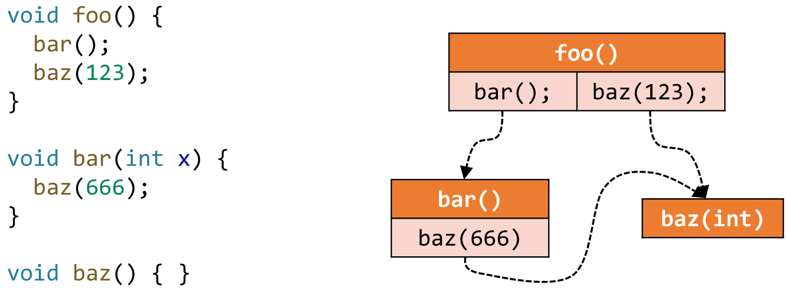

### Call Graph Construction

Call Graph有很多种不同的构造方法，我们接下来会讲解两个极端：最准确的和最快速的。

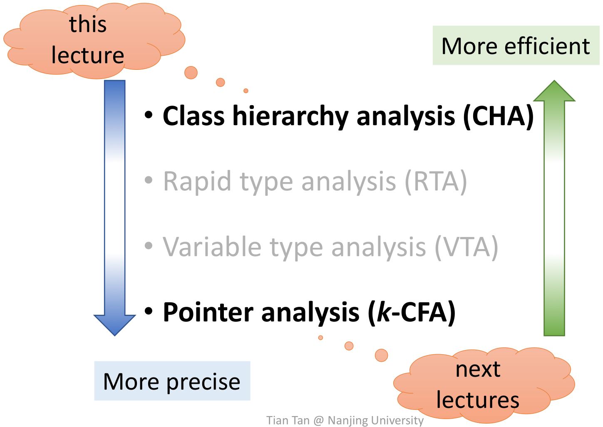

#### Call types in Java

本课主要关注Java的调用关系图构建。为此，我们需要先了Java中调用的类型。Java中call可分为三类（不需要理解透彻，之后会详细介绍）：

* Instruction：指Java的**IR中的指令**
* Receiver objects：方法对应的实例对象（static方法不需要对应实例）。
* Target methods：表达**方法到IR指令的映射关系**
* Num of target methods：call可能对应的方法数量。Virtual call与动态绑定和多态实现有关，可以对应多个对象下的重写方法。所以**Virtual call的可能对象可能超过1个**。
* Determinacy：指什么时候能够确定这个call的对应方法。Virtual call与多态有关，只能在运行时决定调用哪一个具体方法的实现。其他两种call都和多态机制不相关，编译时刻就可以确定。

#### Virtual call and dispatch

Virtual call是几种调用中最为复杂的一种，我们首先重点讨论它。在动态运行时，Virtual call基于两点决定调用哪个具体方法：

1. Type of object
2. Method signature
   * Signature = class type + method name + descriptor
   * Descriptor = return type + parameter types

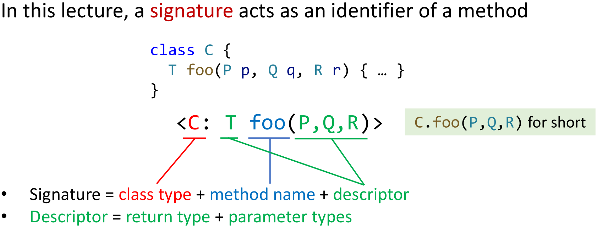

Java中Dispatch机制决定具体调用哪个方法：c是一个类的定义，m是一个方法。如果能在本类中找到name和descriptor一致的方法，则调用c的方法，否则到父类中寻找。

> We define function Dispatch\(𝑐, 𝑚\) to simulate the procedure of run-time method dispatch.

**练习问题**

Q：两次对foo的调用分别调用了哪个类的foo？

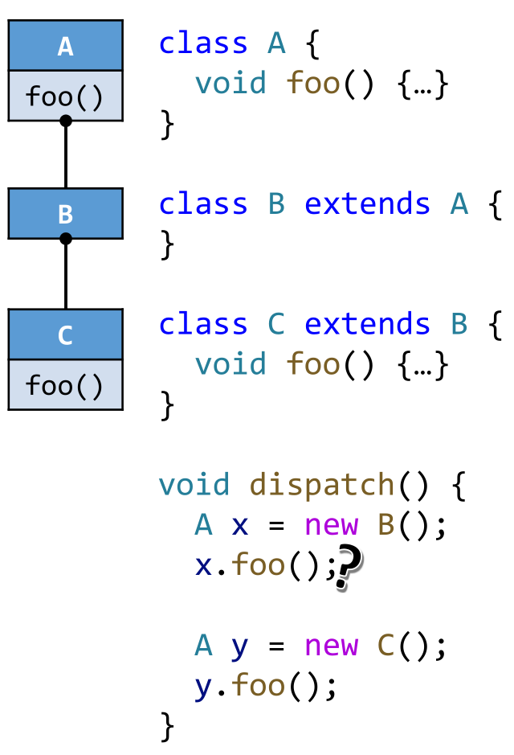

A：分别调用A和C中定义的foo方法。

## Class Hierarchy Analysis \(CHA\)

### Definition of CHA

* Require the class **hierarchy information \(inheritance structure\)** of the whole program
  * 需要首先获得整个程序的继承关系图
* Resolve a virtual call based on the declared type of receiver variable of the call site
  * 通过接收变量的声明类型来解析Virtual call
  * 接收变量的例子：在`a.foo()`中，a就是接收变量
* Assume the receiver variable a may point to objects of class A or all subclasses of A（Resolve target methods by looking up the class hierarchy of class A）
  * 假设一个接收变量能够指向A或A的所有子类

### Call Resolution of CHA

#### Algorithm of Resolve

下面介绍解析调用的算法。

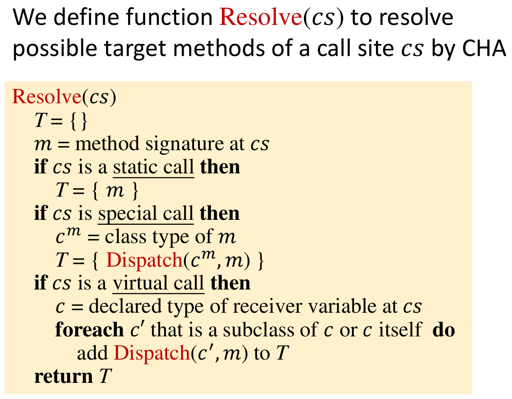

* call site\(cs\)就是调用语句，m\(method\)就是对应的函数签名。
* T集合中保存找到的结果
* 三个if分支分别对应之前提到的Java中的三种call类型
  1. Static call\(所有的静态方法调用\)
  2. Special call\(使用super关键字的调用，构造函数调用和Private instance method\)
  3. Virtual call\(其他所有调用\)

**Static call**

* 对于不了解OOP中静态方法的同学可以参考[这里](https://www.geeksforgeeks.org/static-methods-vs-instance-methods-java/)。具体来说，静态方法前写的是类名，而非静态方法前写的是变量或指针名。静态方法不需要依赖实例。 

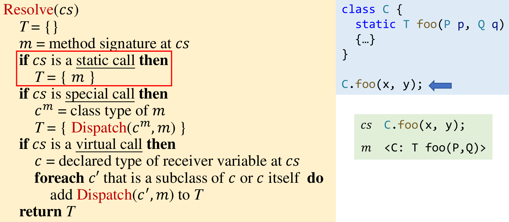

**Special call**

* Superclass instance method（super关键字）最为复杂，故优先考虑这种情况

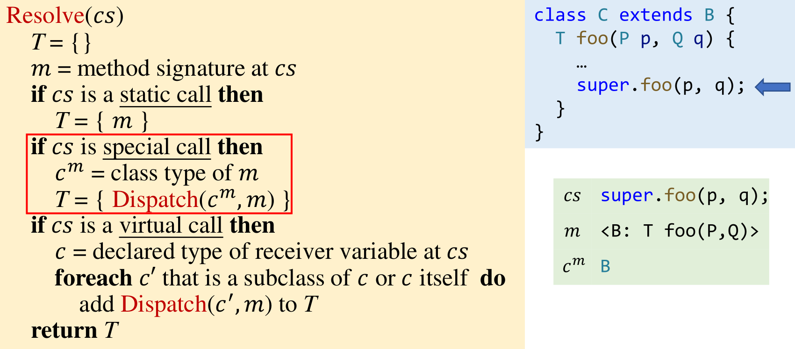

* 为什么需要Dispatch函数？考虑这种情况：

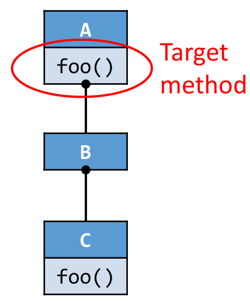

* 而Private instance method和Constructor（一定由类实现或有默认的构造函数）都会在本类的实现中给出，使用Dispatch函数能够将这三种情况都包含，简化代码。

**Virtual call**

* receiver variable在例子中就是c。

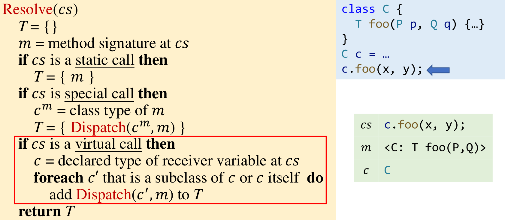

* 对receiver c和c的所有直接间接子类都作为call site调用Dispatch

**一个例子**

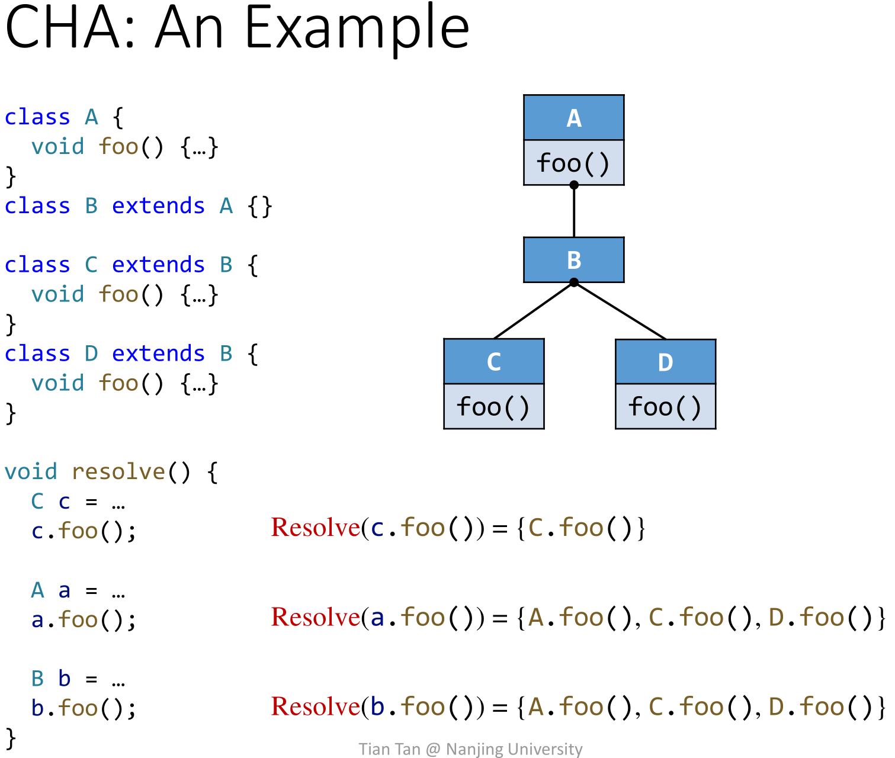

### CHA的特征

1. 只考虑继承结构，所以**很快**
2. 因为忽略了数据流和控制流的信息，所以**不太准确**

### CHA的应用

常用于IDE中，给用户提供提示。比如写一小段测试代码，看看b.foo\(\)可能会调用哪些函数签名。可以看出CHA分析中认为`b.foo()`可能调用A、C、D中的`foo()`方法。（实际上这并不准确，因为b实际上是B类对象，不会调用子类C、D中的方法，但胜在快速）

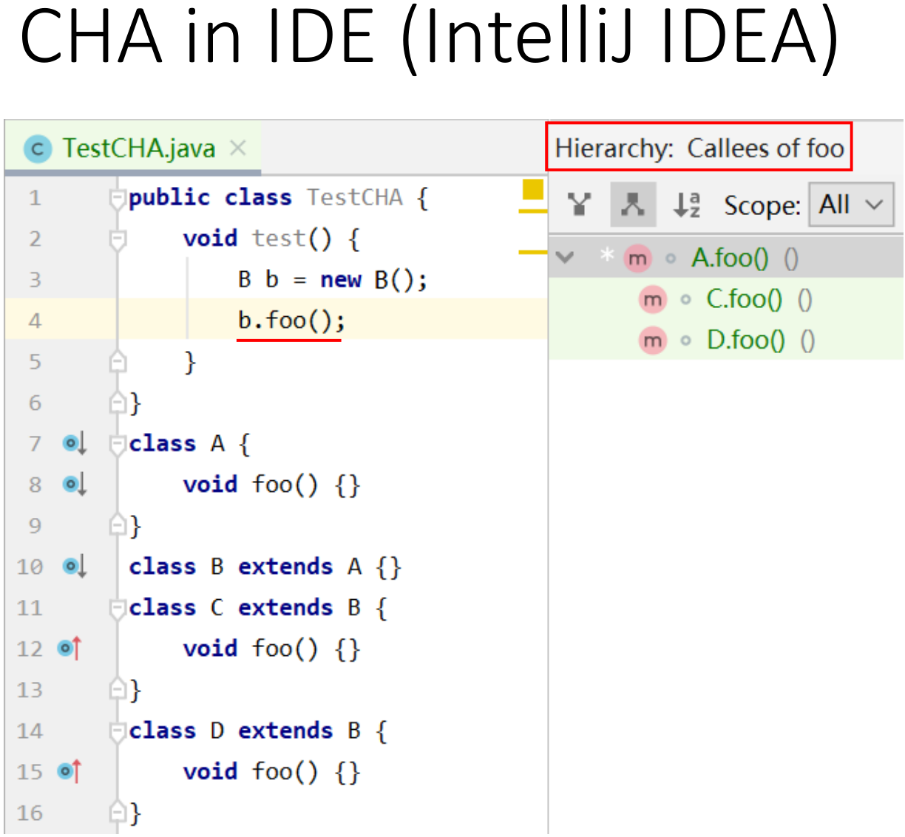

### Call Graph Construction

#### Idea

* Build call graph for whole program via CHA
  * 通过CHA构造整个程序的call graph
* Start from entry methods \(focus on main method\)
  * 通常从main函数开始
* For each reachable method 𝑚, resolve target methods for each call site 𝑐𝑠 in 𝑚 via CHA \(Resolve\(𝑐𝑠\)\)
  * 递归地处理对每个可达的方法
* Repeat until no new method is discovered
  * 当不能拓展新的可达方法时停止
* 整个过程和计算理论中求闭包的过程很相似

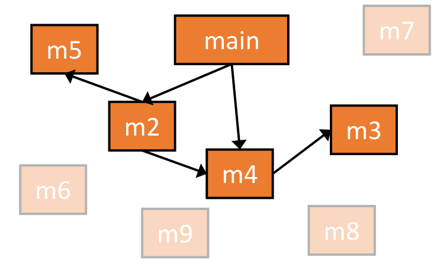

#### Algorithm

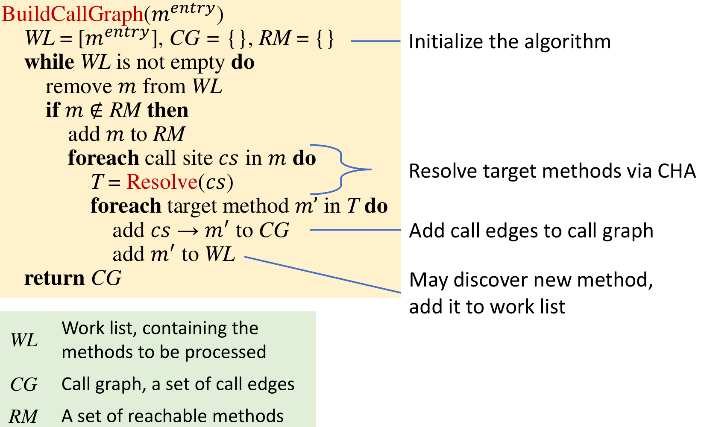

* Worklist记录需要处理的methods
* Call graph是需要构建的目标，是call edges的集合
* Reachable method是已经处理过的目标，在Worklist中取新目标时，不需要再次处理已经在RM中的目标

#### Example

_我也不想当无情的PPT摘抄机器，可是markdown对自己做图的支持太差了啊（x。_

1. 初始化

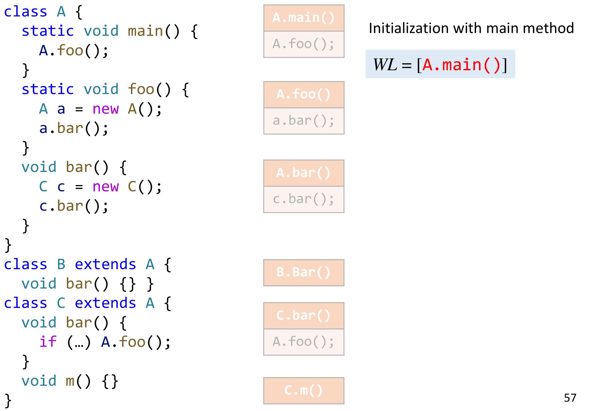

1. 处理main后向WL中加入A.foo\(\)

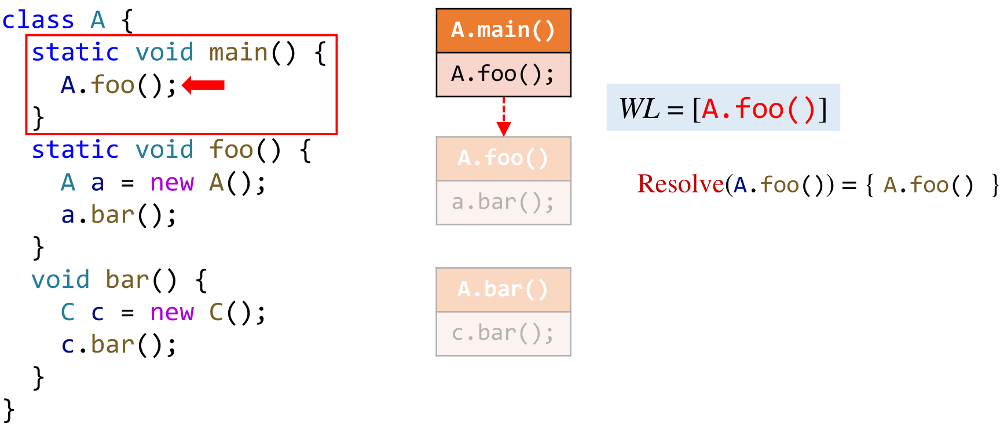

1. 中间省略一些步骤，这里面对C.bar\(\)时，虽然会调用A.foo\(\)，但由于A.foo\(\)之前已经处理过（在集合RM中），之后不会再进行处理

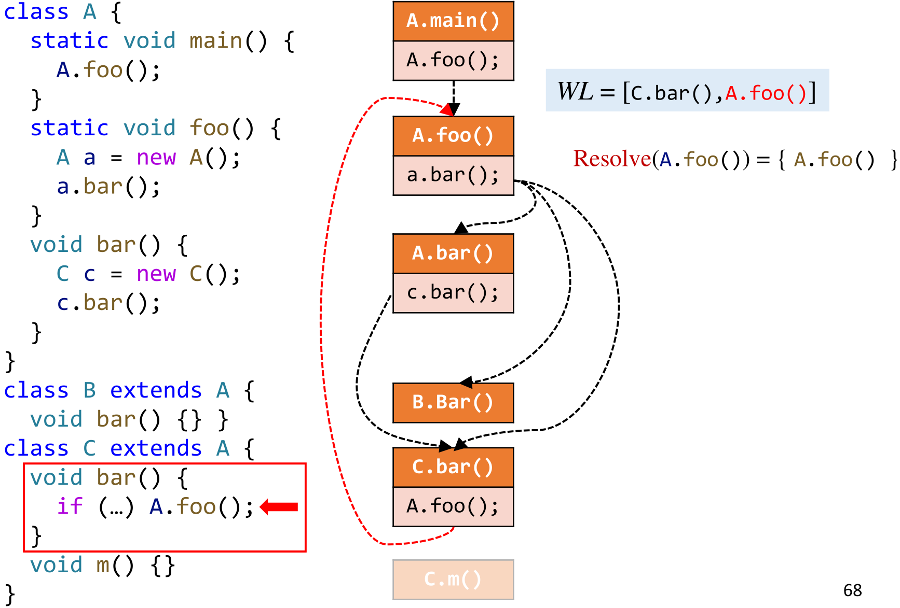

1. 这里C.m\(\)是不可达的死代码

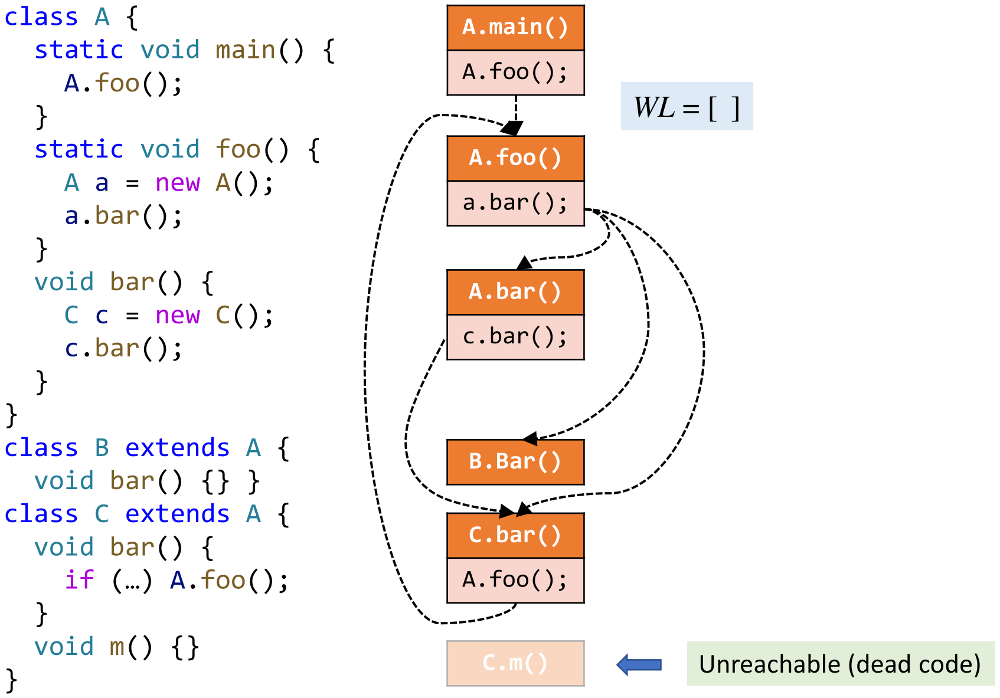

_注：忽略new A\(\)对构造函数的调用，这不是例子的重点。_

**这个例子是对本小节的总结，如果不能读懂并独立推导建议重读一遍。如果你理解了第一到第六课的内容但是觉得上面的内容写得不清晰，可以到本书简介中提到的QQ群交流吐槽。**

### Interprocedural Control-Flow Graph

> ICFG = CFG+call & return edges

ICFG可以通过CFG加上两种边构造得到。

1. Call edges: from call sites to the entry nodes of their callees
2. Return edges: from return statements of the callees to the statements following their call sites \(i.e., return sites\)

例如：

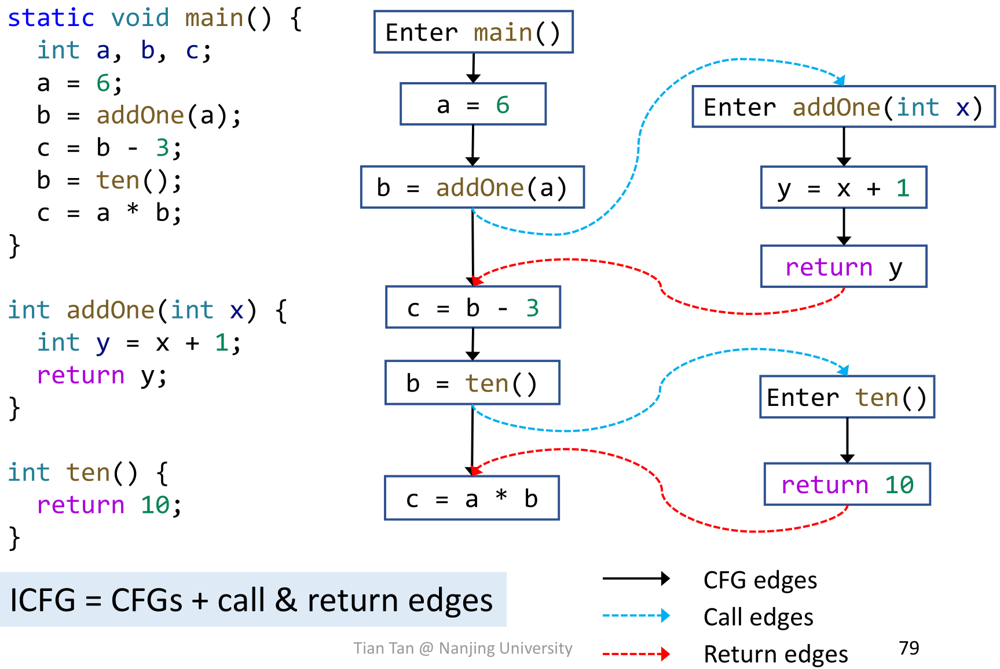

## Interprocedural Data-Flow Analysis

### 定义与比较

目前这一分析领域没有标准方法。首先对过程间和过程内的分析做一个对比，并以常量传播（本校同学第一次实验作业主题，需要一到六课的基础）为例子进行解释。

Edge transfer处理引入的call & return edge。为此，我们需要**在之前章节的CFG基础上增加三种transfer函数。**

* Call edge transfer
  * 从调用者向被调用者传递参数
* Return edge transfer
  * 被调用者向调用者传递返回值
* Node transfer
  * 大部分与过程内的常数传播分析一样，不过对于每一个函数调用，都要kill掉LHS（Left hand side）的变量 

### Example

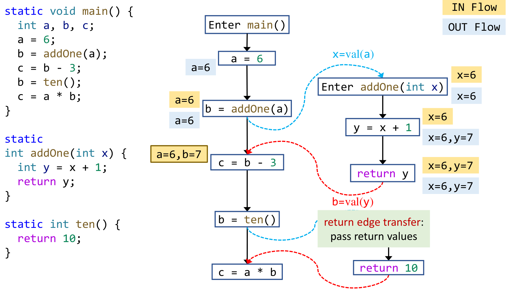

#### 小问题

这一段有存在的必要吗？

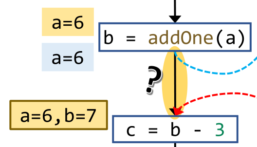

> Such edge \(from call site to return site\) is named call-to-return edge. It allows the analysis to propagate local data-flow \(a=6 in this case\) on ICFG.

如果没有这一段，那么a就得“出国”去浪费地球资源——在分析被调用函数的全程中都需要记住a的值，这在程序运行时会浪费大量内存。

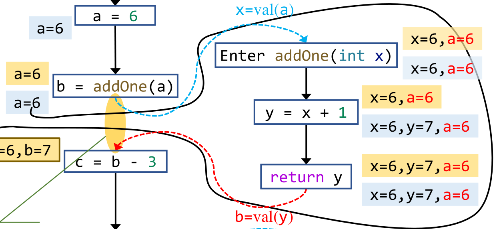

要记得在调用语句处kill掉表达式左边的值，否则会造成结果的不准确，如：

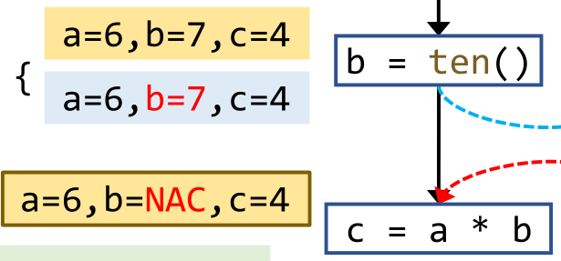

## 过程间分析有多重要？

讲到这里，我们回到故事的开头，看看过程间分析的引入到底能带来多大的精度提高吧。上述例子应用过程间分析的完整推导如下：

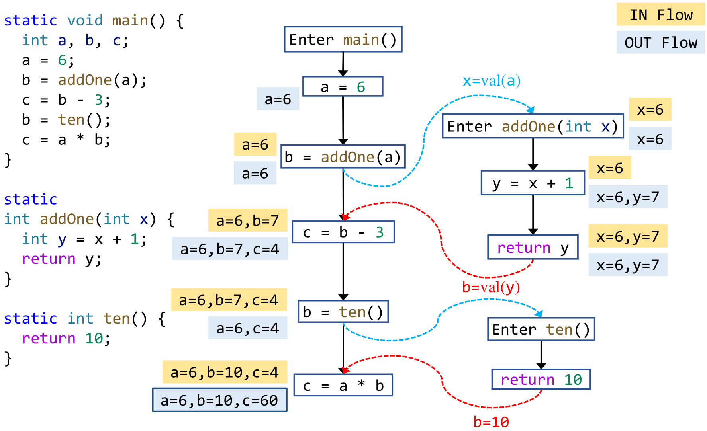

而如果只做过程内分析，则**精度大大下降**：

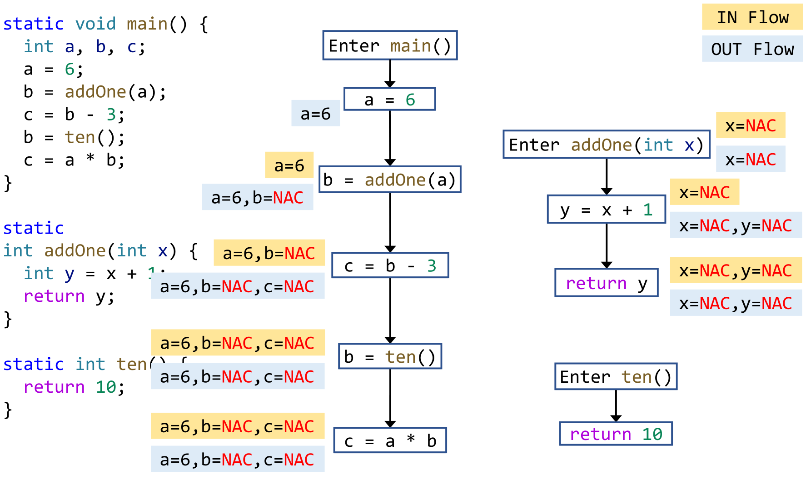

## Key points

**The X You Need To Understand in This Lecture**

1. How to build call graph via class hierarchy analysis
   * 如何利用CHA构建调用关系图\(call graph\)
2. Concept of interprocedural control-flow graph
   * 过程间控制流图\(CFG\)的概念
3. Concept of interprocedural data-flow analysis
   * 过程间数据流分析的概念
4. Interprocedural constant propagation
   * 例子——引入过程间分析的常量分析

