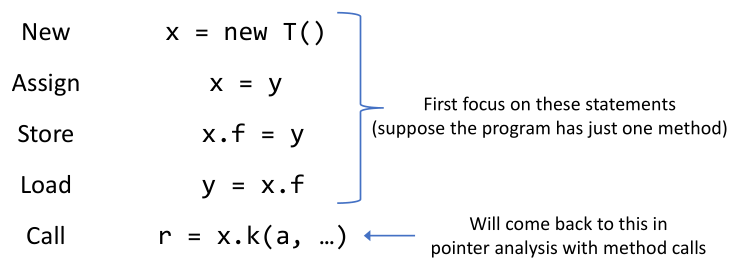
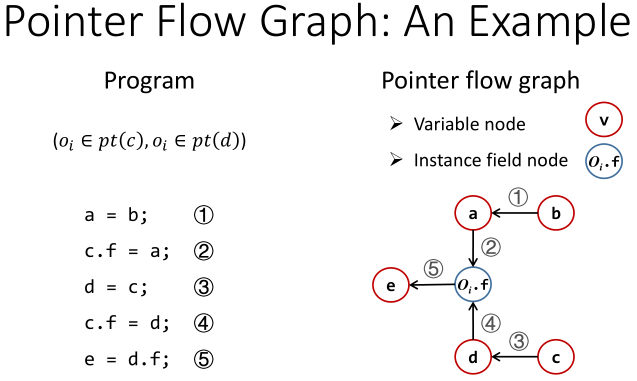
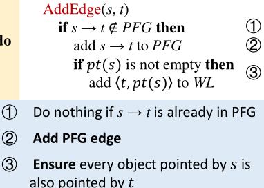
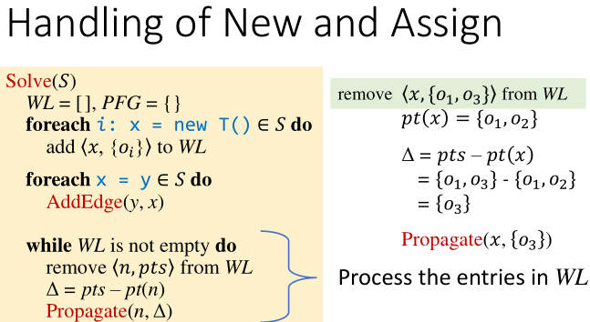
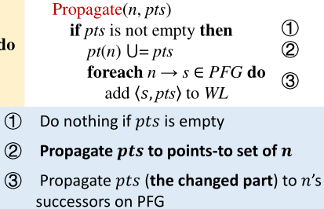
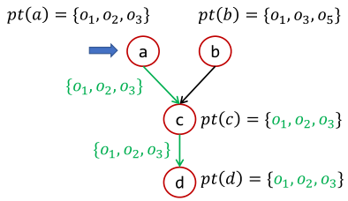
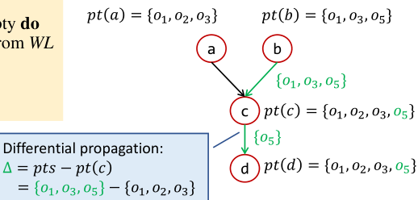

# 指针分析理论基础

## 指针分析理论基础

本文将主要介绍以下四点内容。前三点对应线下课程第九课，最后一点对应第十课。

1. Pointer Analysis: Rules
2. How to Implement Pointer Analysis
3. Pointer Analysis: Algorithms
4. Pointer Analysis with Method Calls

## Notations



首先介绍常用数学符号，不会的同学可以复习一下离散数学。


分别定义变量，域，对象（用下标标识是在第几行创建的对象），实例域和指针（是变量和实例对象的并），和指向关系。`X`表示笛卡尔积。

pt\(p\)代表的是指针p可能指向的对象。如在下面的代码块后，pt(x)可能指向的目标可以记为${o_2,o_4}$（以行号作为object的下标）。

```java
if(...){
    x = new A();
} else {
    x = new B();
}
```

## Pointer Analysis: Rules

_前排提示：与《数理逻辑》/《形式化语义》梦幻联动。没学过的同学也不要着急。_


主要解释Rule一列中的内容。**横线上的内容是前提\(Premises\)，横线下的内容是结论\(Conclusion\)。**

用简单易懂的语言描述，看到new语句，我们就将新建的对象加入`pt(x)`。


对于Assign语句，我们将x指向y指向的对象。


对于Store和Load亦然。


### Summary

最后用一图总结。**第一条规则添加指向，而后三条规则传递指向关系。**


## How to Implement Pointer Analysis

_别处的资料都没有全家桶，只介绍某些特殊情况下的分析算法。在这里你能喜提一个完整的指针分析算法全家桶。_

本质上来说，指针分析是在指针间**传递**指向关系。


inclusion constraints的具体解释：在上述表示的结论部分中可以写作两个集合间的包含关系。如Load应该表示为：

* 前提：`y=x.f`和 $o_i \in pt(x)$
* 结论：$ pt(o_i.f) \subset pt(y)$

>  Key to implementation: when 𝑝𝑡\(𝑥\)is **changed**, **propagate** the **changed par**t to the **related pointers** of 𝑥


### Pointer Flow Graph

> Pointer Flow Graph \(PFG\) of a program is a directed graph  
> that expresses how objects flow among the pointers in the program.

为了实现指针分析，我们首先了解与之密切相关的数据结构——指针流图。

图的两大要素是Node和Edge。我们定义：

* `Node: Pointer = V ⋃ (O × F)`
  * A node n represents **a variable** or **a field of an abstract object**
* `Edges: Pointer × Pointer`
  * **An edge 𝑥 -&gt; 𝑦** means that the objects pointed by pointer 𝑥 **may flow to \(and also be pointed to by\)** pointer 𝑦


### Example

假设c和d一开始都指向 $o_i$，根据上述规则，我们能够从左侧的程序语句从上到下构建出右侧的指针流图。



因此，所有b所指向的对象更新时，都要传递到e中。这是一个求传递闭包\(transitive closure\)的过程。假如我们考虑j位置的一条新语句`b = new T();`


PFG的整个构造过程，需要在构建PFG和在已有的PFG上传递指向关系这两个步骤间循环往复。这两个步骤是相互依赖的，所以需要精心设计算法来实现分析。


## Pointer Analysis: Algorithms

### Introduction to algorithm

* 由于做流不敏感分析。输入为Set，丢失了语句的顺序关系也没关系。
* WorkList：保存接下来要处理的指向信息，与BFS中的队列作用类似。

  * Each worklist entry 𝑛, 𝑝𝑡𝑠 is a pair of pointer 𝑛 and points-to set 𝑝𝑡𝑠, which means that 𝑝𝑡𝑠 should be propagated to 𝑝𝑡\(𝑛\)
  * E.g.,  $[(x,\{o_i\}),(y,\{o_j, o_k\}),(x.f,\{(o_l)\}),\dots]$

首先，四个红框部分对应之前提到的四种基本语句——New、Assign、Store和Load。接下来做详细讲解。


### Handling of New and Assign

#### Init and adding edges


首先考虑两种简单的语句：New和Assign。

* 前三行代码做初始化的工作，并针对所有的**New**语句，将所有的初始指向关系加入WorkList。
* 之后的两行代码处理**Assign**语句，添加`y->x`的边到PFG中。添加边的具体算法如下



#### Propagate



传播的具体算法如下，标号为2的语句是整个算法中唯一执行后改变指向关系的语句。



#### Detial-Differential Propagation

在真实的指针分析中，对象的数量非常巨大（上亿），我们通过Differential Propagation来消除冗余。

```cpp
Solve(𝑆)
    ...
    while WL is not empty do
        remove 𝑛, 𝑝𝑡𝑠 from WL
        Δ = pts – pt(n) // Differential Propagation
        Propagate(n, Δ) // Differential Propagation
```

首先我们考虑不使用Differential Propagation的情况，首先是a-&gt;c-&gt;d的传递路线。



然后是b-&gt;c-&gt;d的传递路线，虽然 $$\{o_1, o_3\}$$之前已经在c所指向的集合中了，但依然需要参与传播，这是冗余的。


我们再来看使用Differential Propagation的情况，只需要传播$$\{o_5\}$$一项即可。在实际应用中这能够大大减小开销。



* In practice, Δ is usually small compared with the original set, so propagating only the new points-to information \(Δ\) 
* Besides, Δ is also important for efficiency when handling stores, loads, and method calls, as explained later

### Handling Store and Load


对于AddEdge函数中第二个if的说明：仅在第一次添加s-&gt;t到PFG时添加pt\(s\)的信息到t，是因为Propagate中的语句能够处理后续的pt\(s\)变化。

### The Algorithm-Review

至此，我们完整地介绍了为了教学目的设计的指针分析算法。


### Example

**尝试用上述算法，计算以下代码的PFG。**

```java
b = new C();
a = b;
c = new C();
c.f = a;
d = c;
c.f = d;
e = d.f;
```


这一例子动态内容很多，所以计划录制一小段视频讲解。先放个答案，能自己推导对的同学就可以跳过视频了。


## Key points

**The X You Need To Understand in This Lecture**

* Understand pointer analysis rules
* Understand pointer flow graph
* Understand pointer analysis algorithms

---

**以下内容对应第10课。**

接下来我们学习用指针分析的方式来构建Call graph，首先对比以下CHA和指针分析两种方法：

-   CHA: imprecise, introduce spurious call graph edges and points-to relations
-   Pointer analysis: more precise than CHA, both for call graph and points-to relations(a.k.a on-the-fly call graph construction)

## Pointer Analysis with Method Calls

本课将给出一个包含函数间分析的适用于全程序的算法。

考虑下面这样一小段代码，显然，我们必须要有过程间的分析，才能有更准确的分析结果。

```java
void foo(A a) {
	…
    // 𝑝𝑡(𝑎) = ?
	b = a.bar();
	// 𝑝𝑡(𝑏) = ?    
	…
}
```

和过程间分析紧密相关的是过程调用的处理。也就是上节课提到的最后一条与Call有关的规则。

这个规则看起来复杂得多，我们一点一点来解析。首先，请读者们暂停一下，回忆一般语言如何处理过程调用。即过程调用时到底发生了什么。


>   ​	一个参考答案：保存现场，构造调用栈帧，传递参数，跳转到目标函数开始执行……目标函数执行完毕跳转回来，后从预定的位置取返回值（若需要），恢复现场，继续往下执行……

在静态分析中，我们更多地关心数据流，而非控制流。而针对Java，处理函数调用的数据流可以分为以下四个部分：

1.  确定目标方法。用第7课介绍过的Dispatch函数完成。
2.  传receiver object


3.  传参数


4.  传返回值


因此，我们可以对应规则，在PFG上添加Edge实现过程间信息的传递。完整的规则如下：


### Detail-1

**Question: Why not add PFG edge 𝑥 → $𝑚_{𝑡ℎ𝑖𝑠}$？**

通过这两个图可以直观地说明原因：


*在每次算法执行时，$o_i$是确定的某个（只有一个）对象，然后针对这个对象做Dispatch，能够找到对应的唯一的receiver object.*


### Detail-2

像之前用CHA做过程间分析时一样，我们需要将分析的过程和Call graph构建的过程结合起来。


不同的是，这次我们只分析从main方法（或者一般性地说，程序入口）开始可达的部分。原因有二：

1.  提升分析速度。因为我们能够避免分析不会被执行到的死代码。
2.  提升分析精度。避免了unreachable部分的代码调用reachable部分方法时可能引起的精度下降。


## Algorithm: PA with Method Calls

接下来介绍一个具体的、易于理解和实现的算法。由于指针分析是静态程序分析的基础，理解了这个看起来枯燥的算法后，更容易在静态程序分析领域触类旁通。~~而且据说后面两节课会学得更加轻松~~


算法整体上来说和上一节课所介绍的大框架相似，黄色标记的部分是这次新加入的部分。绿色部分是对新的全局变量的说明：

-   S里的statements就是RM里methods的statements（语句）
-   Call Graph和指针集作为最后的输出。

### Function: AddReachable

AddReachable的作用是：

- **输入参数**m是最新的可达方法。
- 函数修改维护全局的RM、S和$S_m$，并处理新的方法m中的New和Assign语句。


### Detail-3

**Question: 为什么要检查l->m是否在CG中，即为什么同样的l->m可能不止一次地被处理？**

*l代表call site。可以用行号作为call site的label。*

>   Answer: $o_j, o_k$同样可能通过Dispatch返回同一个m。

### Function:ProcessCall

ProcessCall的作用是：

- 输入的$o_i$是x新指向的目标。
- 函数在可达的语句集合S中，选择所有与x有关的过程调用，做之前提到的数据流相关四步处理（确定被调用方法、传对象、传参数，传返回值）。


## Example

**利用之前学习的算法分析以下代码，构建Call graph和PFG。**

```java
class A {
    static void main() {
        A a = new A();
        A b = new B();
        A c = b.foo(a);
    }
    A foo(A x) { … }  
}
class B extends A {
	A foo(A y) {
        A r = new A();
        return r;
    }
}
```

答案如下：


这个流不敏感的分析算法在分析精度上仍然可以改进。我们将在接下来的课程中学习精度更高的流敏感分析。

# Key points

**The X You Need To Understand in This Lecture**

-   Pointer analysis rule for method call
-   Inter-procedural pointer analysis algorithm
-   On-the-fly call graph construction
